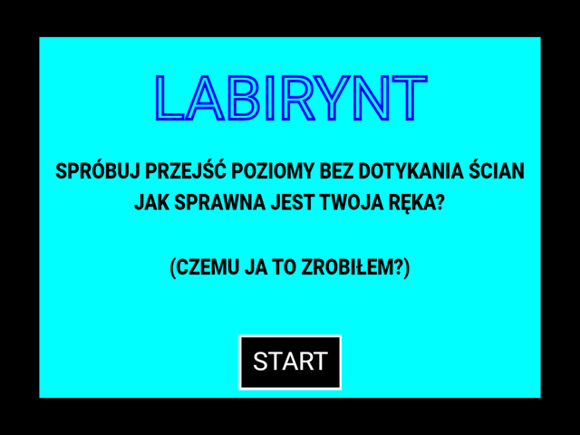
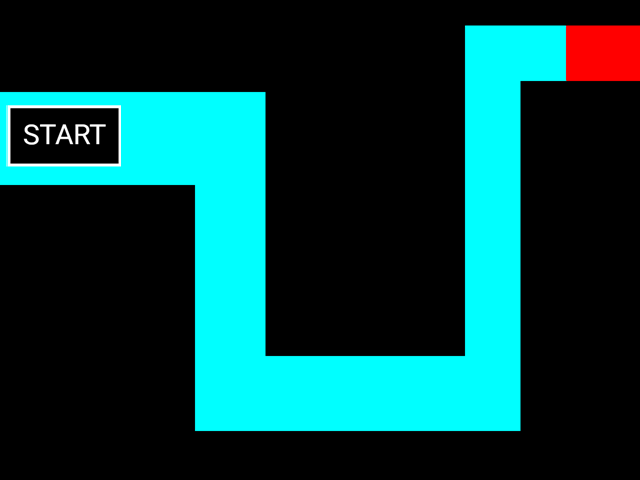
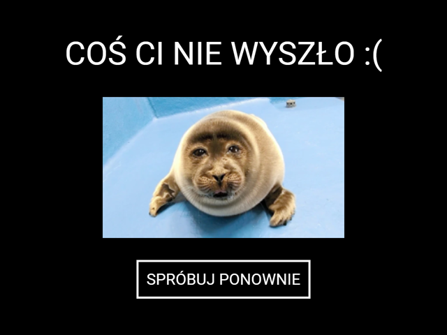

# SealMaze



Remake prostej gry zrobionej w ramach projektu na lekcję, lecz tym razem w Lua. Wzorowana na [internetowym klasyku](https://screamer.wiki/The_Maze) 🦭.

## Użyte biblioteki
- [LÖVE](https://love2d.org/) (wersja 11.5)
- [hump](https://github.com/vrld/hump)

## Jak uruchomić?

Gotowa aplikacja na system Windows oraz plik .love (wymaga zainstalowanego [LÖVE](https://love2d.org/)) znajdują się [tutaj](https://github.com/Jewar-PL2/SealMaze/releases).

Plik SealMaze.love można uruchomić poleceniem
```bash
# MacOS / Linux
love SealMaze.love

# Windows
love.exe SealMaze.love
```

W przypadku instalacji ręcznej sklonuj repozytorium
```bash
git clone --recursive https://github.com/Jewar-PL2/SealMaze.git
```

Wejdź do folderu
```bash
cd SealMaze
```

Uruchom grę (upewnij się, że [LÖVE](https://love2d.org/) jest zainstalowane, a jej binarki dodane do PATH)
```bash
# MacOS / Linux
love .

# Windows
love.exe .
```

W przypadku kompilacji gry do pliku wykonywalnego postępuj według [tego artykułu](https://love2d.org/wiki/Game_Distribution).

## Uwagi

**Ta gra została początkowo stworzona jako projekt szkolny, a obecnie przepisana w Lua z czystej ciekawości. Jakość kodu może być średnia, gdyż pierwszy raz mam do czynienia z tym językiem.**

**Tym razem nie pozdrawiam profilu Technik Programista 🦭**

## Zrzuty ekranu





## Licencja (Dodam, jak ogarnę którą mam dodać)